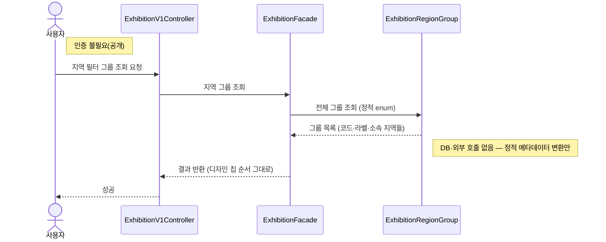

# 지역 필터 그룹 조회

> 시나리오 2.3 — 전시탐색 필터 시트의 지역 칩 목록을 조회한다. 칩 1개 = 그룹 1개이며, 그룹 구성(어떤 지역들을 한 칩으로 묶을지)은 서버가 단일 소스로 관리한다.

> 조회·분기 없는 정적 메타데이터 변환. `ExhibitionRegionGroup` enum을 응답으로 펼치기만 하므로 DB도 외부 호출도 타지 않는다.

**흐름의 요점**
- 클라이언트는 선택한 그룹의 `regions`를 콤마로 이어 목록 조회(01)의 `region` 파라미터에 그대로 넣는다 — 예: `경기·인천` 칩 선택 → `region=GYEONGGI,INCHEON`
- 그룹 구성이 바뀌어도 서버만 고치면 된다(클라이언트는 응답을 그대로 렌더링)
- 모든 `ExhibitionRegion`이 정확히 한 그룹에만 속하는지는 도메인 테스트(`ExhibitionRegionGroupTest`)가 보장한다

