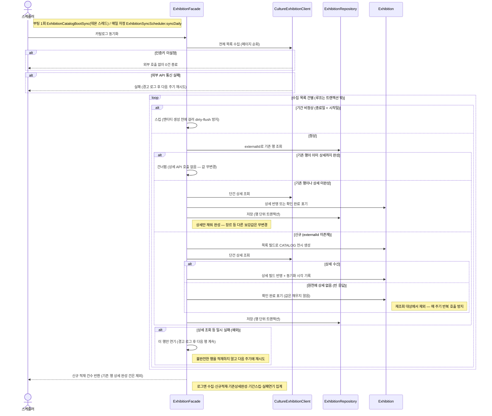

# (시스템) 카탈로그 동기화 — 목록+상세 한 패스

> 시나리오 2.10 — 시스템이 외부 공공데이터 전시 API를 수집해 DB에 적재한다. **목록과 상세를 한 패스로 받아 적재 시점에 곧바로 완전한 행**을 만든다(별도 상세 백필 잡 없음). 부팅 직후 1회(cold start 방지), 이후 매일 자정에 재동기화하며 신규분 장르 분류(07 문서)도 이때 이어서 수행한다.

**다이어그램이 필요한 이유**
- 3갈래 적재 판정: 신규는 상세까지 채워 insert / 기존 미완성 행은 상세만 채워 완성 / 이미 완성된 행은 외부 호출 없이 건너뜀
- 데이터 보존 규칙: 상세 외의 보강값(장르 등)은 재적재로 덮지 않는다 — 전량 완성된 정상 상태에선 값이 안 바뀐다
- 트랜잭션 설계: 루프는 트랜잭션 밖, 행 단위 save만 각자 트랜잭션 — 수백 건 상세 API 호출을 한 트랜잭션에 물지 않는다(커넥션 장기 점유 방지)
- 실패 격리: 기간 비정상은 스킵, 상세 호출 일시 실패는 그 행만 연기 — 단건이 배치 전체를 중단시키지 않는다

