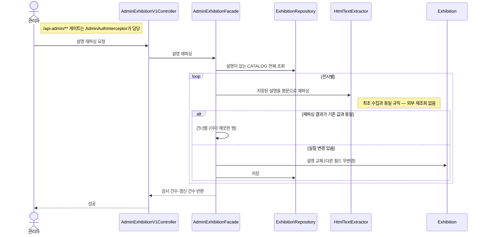

# (관리자) 전시 설명 재파싱

> 이미 적재된 CATALOG 전시의 설명에 남아 있는 HTML·워드프레스 마크업을 벗긴다. 수집 파싱 규칙이 개선되기 전에 들어온 기존 데이터를 사후 정리하는 운영성 작업으로, 프론트에 노출되지 않는 내부 API다(Swagger 문서에서도 제외).

**다이어그램이 필요한 이유**
- 외부 재조회 없음: 원천을 다시 부르지 않고 **저장된 값만** 최초 수집과 동일한 규칙(`HtmlTextExtractor`)으로 다시 판다
- 멱등성: 재파싱 결과가 기존 값과 같으면 저장하지 않는다 — 여러 번 실행해도 이미 깨끗한 행은 건드리지 않는다
- 영향 범위 격리: 설명 필드만 갱신하고 장르·상세 등 다른 보강값은 손대지 않는다

